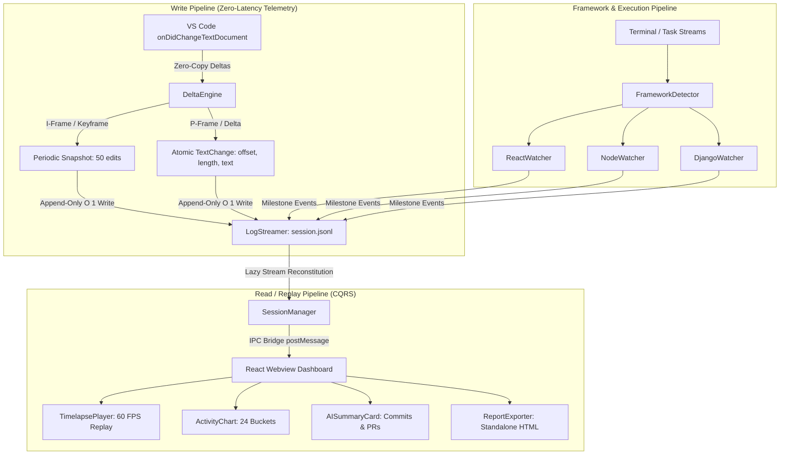

# ⚡ CodeLapse (VS Code Extension)

> **Passive background session recorder, multi-file code timelapse replay player, and AI-driven development analytics for VS Code.**

[](https://www.typescriptlang.org/)
[](https://reactjs.org/)
[](https://code.visualstudio.com/)
[-brightgreen.svg)]()
[]()

---

## 🎬 Quick Showcase: Live Full-Stack Demo Report

We have pre-generated a complete, self-contained standalone demo report showcasing a developer building a **Full-Stack Task Management app (React + Node.js Express + TypeScript)** from scratch to completion.

### How to View the Demo:
1. Double-click or open [`demo_showcase_report.html`](./demo_showcase_report.html) in any web browser (**Google Chrome, Safari, Edge, Firefox**).
2. **Watch the Code Timelapse**:
   - Press **`▶ Play`** or drag the timeline scrubber to watch the code write itself line by line.
   - Watch the active file tabs automatically switch between `server/src/index.ts`, `server/src/types.ts`, `client/src/App.tsx`, and `client/src/components/TaskCard.tsx`.
   - Click the milestone markers on the slider:
     - `✕` / `✓` **Test Run Failures & Fixes**
     - `⚛️` **React / Vite HMR Updates**
     - `🚀` **Node.js Express Server Startup**
     - `📦` **NPM Package Additions**
   - Check the **Top Metrics Row**, the **24-Bucket Activity Distribution**, and the **AI Summarizer (Conventional Commits & PR description)**!

---

## 🚀 Key Features

### 1. 🎥 60 FPS Interactive Timelapse Player
- **Scrubbable Timeline**: Smooth, video-style timeline slider with frame-by-frame stepping (`⏮️` / `⏭️`) and variable speeds (`1x`, `2x`, `5x`, `10x`).
- **Exact Cursor & Selection Tracking**: Reconstructs typing cursor positions (`|`) and highlighted selection ranges in real-time.
- **Syntax Highlighting**: Embedded PrismJS syntax engine supporting TypeScript, JavaScript, Python, CSS, JSON, HTML, etc.
- **Multi-File Workspace Awareness**: Automatically transitions between files as edits jump across the project.

### 2. 📊 24-Bucket Activity & Mini-Diff Heatmaps
- Slices the session duration into **24 proportional temporal buckets**.
- **Interactive Mini-Diff Hover**: Hover over any bucket to see the exact time slice, character volume, and a mini-diff preview of lines added (`+`) and removed (`-`).
- **Line Edit Heatmaps**: Algorithmic line diffing that highlights code churn and the most heavily modified lines.

### 3. 🧠 Framework-Specific Intelligence
- **⚛️ React / Next.js / Vite**:
  - Intercepts Vite HMR updates (`[vite] hmr update <file>`) and Next.js Fast Refresh compilation timings.
  - Detects React Hook additions (`useState`, `useEffect`, custom hooks) and catches runtime render errors.
- **🟢 Node.js / Express / NestJS**:
  - Tracks `nodemon`, `tsx watch`, and `node --watch` restart/exit lifecycles.
  - Automatically captures server listening ports (e.g. `http://localhost:5000`) and npm package installations.
- **🐍 Django / Python**:
  - Intercepts `makemigrations` and `migrate` database schema executions (`Applying <app>.<migration>... OK`).
  - Tracks Django `StatReloader` changes and system check passes.

### 4. 🤖 AI Session Intelligence & Summarizer
- **Conventional Commit Generator**: Auto-generates structured messages (e.g. `feat(auth): ...` or `fix(jwt): ...`) based on net line counts and test results.
- **Markdown PR Description**: Produces ready-to-copy GitHub Pull Request summaries with modified file tables, test pass rates, and session highlights.
- **Daily Standup Report**: One-click summary formatted for Slack / Microsoft Teams.

### 5. 📥 Standalone Single-File HTML Exporter
- Export your session to a standalone `.html` file that embeds the entire React dashboard, PrismJS highlighter, styles, and replay dataset.
- Shareable with professors, teammates, and recruiters without requiring VS Code installed.

---

## 🏛️ Computer Science Architecture & Design

CodeLapse implements modern, industry-standard systems and software engineering patterns:



### Core CS Paradigms:
1. **Event Sourcing & Delta Compression (\(O(N \cdot L) \to O(\Delta)\))**:
   - Instead of duplicating full file text strings on every keystroke, CodeLapse captures atomic `TextChange` deltas (`rangeOffset`, `rangeLength`, `text`).
   - Uses a **Keyframe (I-Frame)** every 50 edits and lightweight **Deltas (P-Frames)** in between, reducing storage footprint and memory by over **90%**.
2. **Write-Ahead Logging (WAL) & Append-Only Streaming (\(O(1)\) Non-Blocking IO)**:
   - Eliminates `JSON.stringify` event loop freezes by writing single lines to `session-<timestamp>.jsonl` using Node's `fs.createWriteStream`.
3. **CQRS (Command Query Responsibility Segregation)**:
   - Decouples the ultra-lightweight write recorder from the heavy analytics and diffing engine.
4. **Strategy / Plugin Pattern**:
   - `FrameworkDetector` scans project manifests and dynamically attaches active framework watchers without monolithic bloat.

---

## 🛠️ Getting Started & Quickstart

### Prerequisites
- [Node.js](https://nodejs.org/) (v18+ recommended)
- [VS Code](https://code.visualstudio.com/) (v1.85+)

### Installation & Build

```bash
# 1. Clone repository
git clone https://github.com/Shanthan2307/Codelapse_ext.git
cd Codelapse_ext

# 2. Install dependencies
npm install

# 3. Compile extension and React webview bundles
npm run compile

# 4. Run automated test suite
npm test
```

### Running in VS Code
1. Open the project folder in VS Code.
2. Press **`F5`** (or go to **Run & Debug** and click **"Run CodeLapse Extension"**).
3. An **`[Extension Development Host]`** window will open.
4. In that window, write code, run terminal commands, and open the Command Palette (`Cmd+Shift+P` / `Ctrl+Shift+P`):
   - **`CodeLapse: Show Session Report & Analytics`**
   - **`CodeLapse: Export Standalone HTML Report`**
   - **`CodeLapse: Stop Recording Session`**
   - **`CodeLapse: Start Recording Session`**

---

## 🧪 Test Suite

CodeLapse includes a comprehensive Mocha test suite covering core analytics, delta reconstruction, debouncing, framework watchers, and AI summarization:

```
  SessionSummarizer AI & Standup Intelligence Tests
    ✔ generates structured conventional commits and PR summaries from session data

  AnalyticsEngine Unit Tests
    ✔ accurately computes session duration
    ✔ accurately calculates net lines written across multiple files
    ✔ accurately computes total estimated keystrokes
    ✔ generates a 24-bucket activity array representing the session timeline
    ✔ calculates line edit heatmaps with accurate edit counts and intensity
    ✔ produces comprehensive session analytics summary

  DeltaEngine Keyframe & Delta Patching Tests
    ✔ applies simple atomic insertions and deletions correctly
    ✔ reconstructs file text accurately from a Keyframe + Delta sequence
    ✔ folds a live delta stream onto per-file baselines, not onto empty text
    ✔ materializes multi-file DeltaSnapshots into chronological full Snapshots

  DocumentTracker Debounce & Milestone Tests
    ✔ batches rapid keystrokes within 500ms into a single snapshot (82ms)
    ✔ independently tracks debouncing across distinct multi-file paths (61ms)
    ✔ triggers a large-delete SessionEvent when more than 50 characters are deleted (62ms)

  Framework Watchers Unit Tests
    ✔ ReactWatcher intercepts Vite and Next.js HMR compilation events
    ✔ NodeWatcher intercepts Nodemon restarts, package additions, and server ports
    ✔ DjangoWatcher intercepts migrations, system checks, and StatReloader reloads

  17 passing (249ms)
```

---

## 📁 Repository Structure

```
codelapse_ext/
├── src/
│   ├── ai/
│   │   └── SessionSummarizer.ts       # AI Conventional Commit & PR Generator
│   ├── analytics/
│   │   └── engine.ts                  # 24-Bucket Timeline, Heatmap & Session Metrics
│   ├── events/
│   │   └── EventMonitor.ts            # Task & Debug execution & Idle timer monitor
│   ├── export/
│   │   └── ReportExporter.ts          # Standalone Single-File HTML Bundler
│   ├── frameworks/
│   │   ├── types.ts                   # Framework Watcher Interfaces
│   │   ├── FrameworkDetector.ts       # Dynamic Workspace Manifest Scanner
│   │   ├── ReactWatcher.ts            # React / Next.js / Vite HMR & Hook Watcher
│   │   ├── NodeWatcher.ts             # Node.js / Nodemon & Package Watcher
│   │   └── DjangoWatcher.ts           # Django Migrations & StatReloader Watcher
│   ├── storage/
│   │   └── LogStreamer.ts             # Append-Only JSONL Write-Ahead Logger
│   ├── tracker/
│   │   ├── DeltaEngine.ts             # Keyframe (I-Frame) & Delta (P-Frame) Compression
│   │   ├── DocumentTracker.ts         # VS Code Text & Selection Event Ingestion
│   │   └── SessionManager.ts          # Local Persistence & Session Lifecycle Manager
│   ├── ui/
│   │   ├── App.tsx                    # Main React Dashboard Shell
│   │   ├── styles.css                 # Theme-Native VS Code Design System
│   │   └── components/
│   │       ├── AISummaryCard.tsx      # AI Commit & Standup Tabbed UI
│   │       ├── ActivityChart.tsx      # 24-Bucket Keystroke Timeline Bar Chart
│   │       ├── ActivityTooltip.tsx    # Interactive Mini-Diff Hover Popover
│   │       ├── MetricsRow.tsx         # Duration, Keystroke, Net Lines & Run Stats
│   │       └── TimelapsePlayer.tsx    # 60 FPS Code Video Replay with Cursor Tracking
│   ├── webview/
│   │   ├── ReportPanel.ts             # VS Code Webview Panel Singleton & IPC Bridge
│   │   └── index.tsx                  # Webview React 18 Entrypoint
│   ├── extension.ts                   # VS Code Extension Host Entrypoint & Commands
│   └── models.ts                      # Core Data Models & Telemetry Schemas
├── scripts/
│   └── generate_showcase_session.ts   # Full-Stack Showcase Generator
├── demo_showcase_report.html          # Standalone Interactive HTML Showcase Demo
├── package.json                       # Extension Manifest & Dependencies
├── tsconfig.json                      # Strict TypeScript Configuration
└── webpack.config.js                  # Dual-Target (Node + Webview) Webpack Bundler
```

---

## 📜 License
MIT © Shanthan & CodeLapse Contributors
